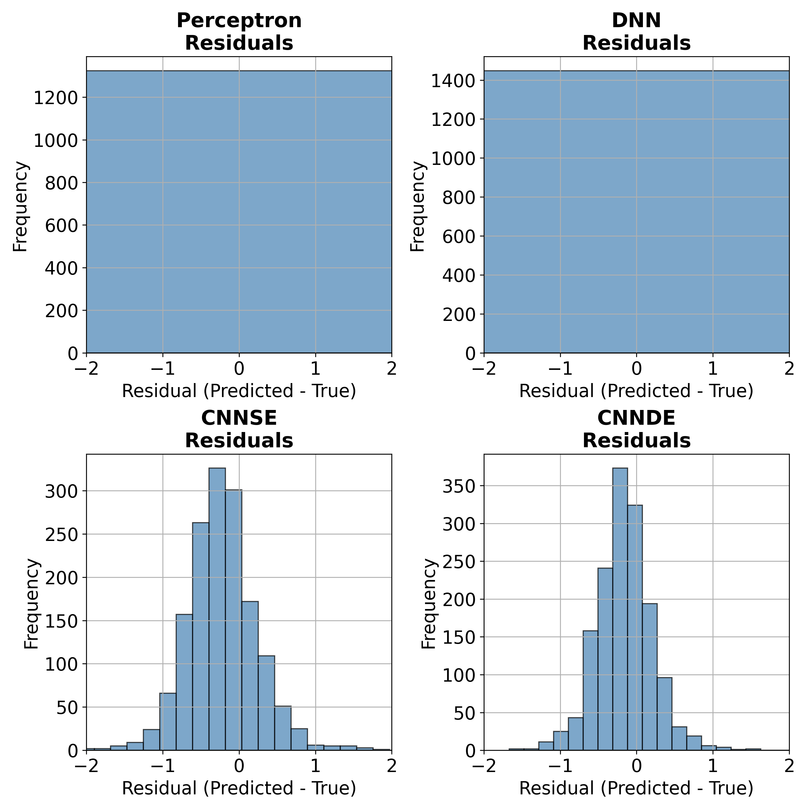

# DeepML
Deep Learning for Earthquake detection and Magnitude Estimation (Scalar approach)
# Examples in Test dataset
 
# Classification stats in Test dataset (Earthquake Classification)
 
 
# Regression stats in Test dataset (Magnitude estimation)
 
 